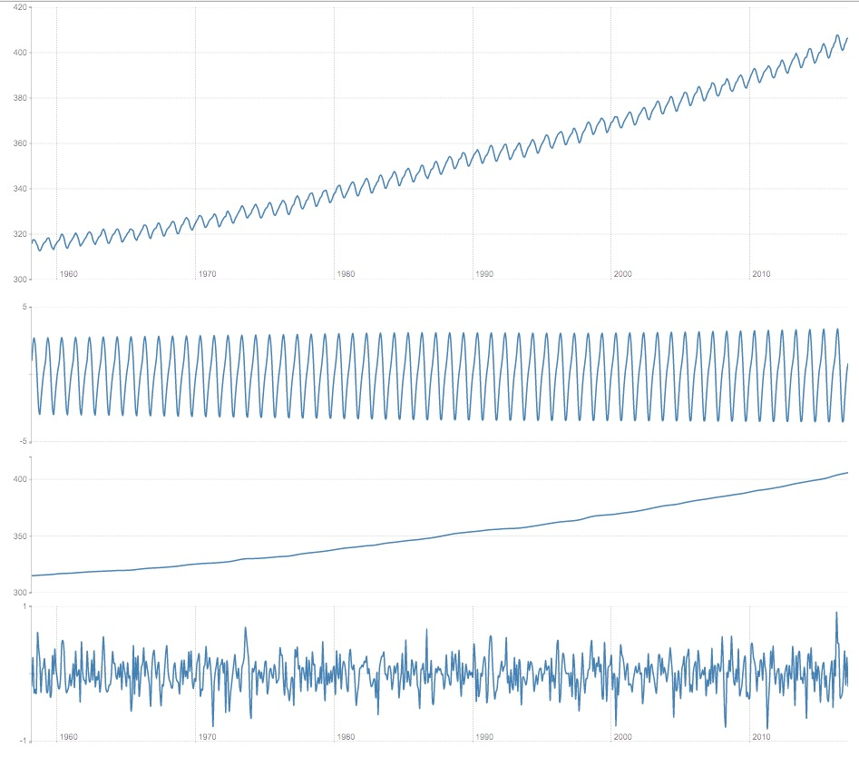

# stl-decomp-4j

stl-decomp-4j is a Java implementation of [STL: A Seasonal-Trend Decomposition Procedure Based on Loess](http://www.wessa.net/download/stl.pdf). This version is a port of the original Ratfor/Fortran version available from [Netlib](http://netlib.org/a/stl), with an extension to support local quadratic interpolation (the underlying LOESS interpolation can do flat (degree = 0), linear (degree = 1) or quadratic (degree = 2) local interpolation).

As with the original Fortran version, this version of the STL algorithm expects equally spaced data with no missing values.

## Example

```
double[] values; // ...

SeasonalTrendLoess smoother = stlBuilder.
    setPeriodLength(12).
    setSeasonalWidth(35).
    setNonRobust().
    buildSmoother(values);

SeasonalTrendLoess.Decomposition stl = smoother.decompose();
```


