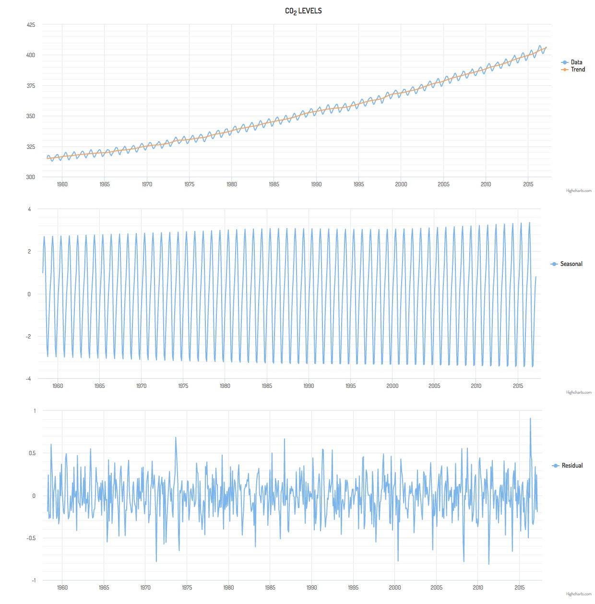

# Seasonal Decomposition of Time Series by Loess

[](https://travis-ci.org/ServiceNow/stl-decomp-4j)
[](https://opensource.org/licenses/Apache-2.0)

The Seasonal-Trend-Loess (STL) algorithm decomposes a time series into seasonal, trend and residual components. The algorithm uses [Loess interpolation](https://en.wikipedia.org/wiki/Local_regression) (original paper [here](https://pdfs.semanticscholar.org/414e/5d1f5a75e2327d99b5bbb93f2e4e241c5acc.pdf)) to smooth the cyclic sub-series (e.g. all January values in the CO<sub>2</sub> data shown in the example below). After removing the seasonality from the signal, the remainder is smoothed (in multiple steps) to find the trend. This process is repeated and may include robustness iterations that take advantage of the weighted-least-squares underpinnings of Loess to remove the effects of outliers. The details are described in [STL: A Seasonal-Trend Decomposition Procedure Based on Loess](http://www.wessa.net/download/stl.pdf).   

**_stl-decomp-4j_** is a Java port of the original Ratfor/Fortran available from [Netlib](http://netlib.org) ([original source here](http://netlib.org/a/stl); also included as part of `examples/StlPerfTest/fortran_benchmark`), extended to support local quadratic interpolation. **_stl-decomp-4j_** expects equally spaced data with no missing values, similar to the original  Fortran version (and the [R](https://stat.ethz.ch/R-manual/R-devel/library/stats/html/stl.html) and [Python](https://github.com/jcrotinger/pyloess) versions, which both use the original Fortran version under the hood).

Check out the [the **_stl-decomp-4j_** wiki](https://github.com/ServiceNow/stl-decomp-4j/wiki) for TODOs, etc.

## Example

At a minimum, the STL algorithm requires specifying the periodicity of the data (e.g. 12 for monthly) and the width of the Loess smoother used to smooth the cyclic seasonal sub-series. In general, there are three Loess smoothers that each require three parameters: a width, a degree, and a jump. The width specifies the number of data points that the local interpolation uses to smooth each point, the degree specifies the degree of the local polynomial that is fit to the data, and the jump specifies how many points are skipped between Loess interpolations, with linear interpolation being done between these points. Because of this complexity, construction is done via `Builder` objects, as shown in this simple example.

```java
double[] values = getSomeMonthlyData(); // Monthly time-series data

SeasonalTrendLoess.Builder builder = new SeasonalTrendLoess.Builder();
SeasonalTrendLoess smoother = builder.
			setPeriodLength(12).    // Data has a period of 12
			setSeasonalWidth(35).   // Monthly data smoothed over 35 years
			setNonRobust().         // Not expecting outliers, so no robustness iterations
			buildSmoother(values);

SeasonalTrendLoess.Decomposition stl = smoother.decompose();
double[] seasonal = stl.getSeasonal();
double[] trend = stl.getTrend();
double[] residual = stl.getResidual();
```

The [StlDemoRestServer example](examples/StlDemoRestServer) includes a copy of the [Monthly CO<sub>2</sub> Measurement Data](http://www.esrl.noaa.gov/gmd/ccgg/trends/) and a simple REST server that reads this data, performs an STL decomposition on the data, and serves up the results to `http://localhost:4567/stldemo`. The `examples/StlDemoRestServer/index.html` file loads the data from this server and plots the resulting decomposition. The code that does the actual decomposition is identical to that shown above, resulting in the following decomposition:



## Benchmarking

The [StlPerfTest example](examples/StlPerfTest) times the STL running on the CO<sub>2</sub> data mentioned above or on a time-series of 10 years of random hourly data. The same benchmark is implemented in the original Fortran [here](examples/StlPerfTest/fortran_benchmark). See [Performance Tests](examples/StlPerfTest/PerformanceTest.md) for instructions on running these tests. 

Limited testing show the Java to be about half the speed of the Fortran. A comparison of the resulting decompositions is shown in the [StlJavaFortranComparison notebook](examples/StlPerfTest/StlJavaFortranComparison.ipynb).

## Extension to include exogenous inputs 

The STL method is extended to incorporate exogenous inputs where details can be found in the [StlExogenous example](https://github.com/ServiceNow/stl-decomp-4j/tree/master/examples/StlExogenous). 
To apply these inputs, simply build the smoother with them (`double[][] exogenousinputs` with each row being an input) as illustrated below. Afterwards, the `.decompose()` method is again applied and the `.getTrend()` now extracts the combined effect of the trend and exogenous inputs. 

```java 
SeasonalTrendLoess smoother = builder.buildSmoother(values, exogenousinputs) 
```

## Documentation

The implementation of the quadratic extension of `LoessInterpolator` is described, mathematically, in [ImplementationNotes](stl-decomp-4j/docs/ImplementationNotes.pdf).

`TODO: JavaDoc link goes here`

## Build Dependencies
To include **_stl-decomp-4j_** in your maven project, add the following to your pom file:

```xml
        <dependency>
          <groupId>com.github.servicenow.stl4j</groupId>
          <artifactId>stl-decomp-4j</artifactId>
          <version>1.0.5</version>
        </dependency>
```

The **_stl-decomp-4j_** implementation has no external dependencies.

The unit tests depend on `junit`, `commons-math3` and `slf4j-simple`.

The examples have further dependencies on `commons-cli`, `opencsv`, `spark-core`, and `jackson-mapper-asl`.
