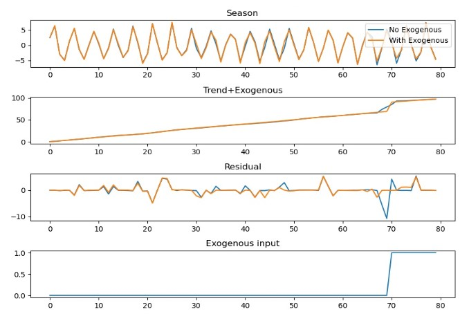

## Extension to include exogenous variables

To include exogenous inputs to linear regression models, corresponding extra columns are typically added to the regressor matrix. In a similar manner, the part of the STL method where such a regression takes place, and therefore to where such inputs can be added, is the local trend interpolation/smoothing part on
the deseasonalized data. Thus, after seasonality removal in each inner iteration of the STL, the exogenous inputs can be treated together with the local trend.

As detailed in [ImplementationNotes](https://github.com/ServiceNow/stl-decomp-4j/blob/master/stl-decomp-4j/docs/ImplementationNotes.pdf), a local (quadratic) trend model is given by y(x)= a0 + a1 x + a2 x2 and the best fitting coefficients are found by minimizing sumi wi (yi - y(xi))2 with external weights wi, which corresponds to a weighted least-squares fit.
The exogenous inputs, denoted by vi and also varying with x, are simply included as y(x, v1, v2, ..., vn)= a0 + a1 x + a2 x2 + sumi=1n ci vi.

As a demonstration on a synthetic series, a time-series having a sinusoidal seasonality with an amplitude of 5, a trend component with an increment of 1, and an exogenous input of a level shift occurring at the time index 70 with a magnitude of 20 is considered.

By inspection of the above plots, it is clear that the extended STL's trend + exogenous component accurately models the sudden jump at the index 70. This is also evident from the residual plot where the traditional STL without the exogenous input exhibits a large residual around the time of this level shift. Note here that the exogenous input is plotted without its magnitude, only as an input to the model.

